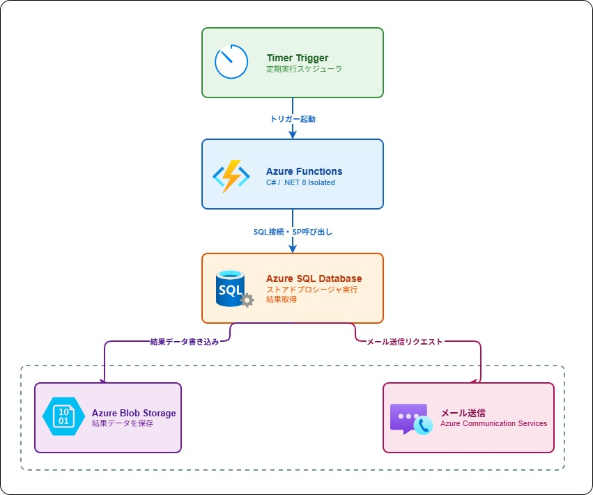

# 要件定義書

## プロジェクト概要

| 項目 | 内容 |
|------|------|
| プロジェクト名 | Azure定期バッチ処理システム |
| 作成日 | 2026年5月 |
| 環境 | Microsoft Azure |
| 目的 | 個人学習 |

---

## 1. 目的

Azureのマネージドサービスを活用し、定期的にデータベースのストアドプロシージャを実行し、その結果をストレージに保存・メール通知するバッチ処理システムを個人学習として構築する。インフラをTerraform（IaC）で管理することで、再現性・保守性の高い開発を学ぶ。

---

## 2. システムアーキテクチャ



---

## 3. 使用Azureサービス一覧

| サービス | 用途 | プラン |
|---------|------|--------|
| Azure Functions | 定期バッチ処理実行 | 従量課金（Y1） |
| Azure SQL Database | データ管理・ストアドプロシージャ | Basic |
| Azure Blob Storage | 処理結果のJSON保存 | Standard / LRS |
| Azure Communication Services | メール送信通知 | 従量課金 |

---

## 4. 機能要件

### 4.1 定期実行機能
- Timer Triggerを使用して定期的に自動起動する
- 実行スケジュール：毎朝9時（`0 0 9 * * *`）
- 手動実行にも対応する

### 4.2 ストアドプロシージャ実行機能
- Azure SQL Databaseに接続する
- 指定のストアドプロシージャ（`dbo.MyStoredProcedure`）を実行する
- 実行結果（レコード）を取得する

### 4.3 結果保存機能
- ストアドプロシージャの実行結果をJSON形式にシリアライズする
- Azure Blob Storageの`sp-results`コンテナに保存する
- ファイル名は実行日時を使用する（例：`result_20260515_090000.json`）

### 4.4 メール通知機能（後フェーズ）
- Blob保存完了後にメールを送信する
- メール本文に保存ファイル名と件数を含める
- Azure Communication Servicesを使用する

---

## 5. 非機能要件

| 項目 | 内容 |
|------|------|
| 可用性 | Azureマネージドサービスの標準SLAに準拠 |
| セキュリティ | 接続情報はすべて環境変数で管理、ソースコードへの直書き禁止 |
| 保守性 | インフラはTerraformで管理し再現可能な状態を維持 |
| コスト | 個人学習のため最小プランを使用 |

---

## 6. 開発方針

### 6.1 IaC（Infrastructure as Code）
- インフラ構築にはTerraformを使用する
- リージョン：Japan East
- 環境名：dev

### 6.2 アプリケーション開発
- 言語：C#（.NET 8 Isolated）
- デプロイ：Azure Functions Core Tools または VS Code拡張機能を使用

### 6.3 DB初期化
- テーブル・ストアドプロシージャはAzure Data Studioを使用して手動で作成する

### 6.4 バージョン管理
- GitHubでソースコードを管理する

---

## 7. 構成管理

### リポジトリ構成

```
azure-batch-system/
├── README.md
├── docs/
│   └── requirements.md
├── terraform/
│   ├── main.tf
│   ├── variables.tf
│   ├── terraform.tfvars.example
│   ├── resource_group.tf
│   ├── sql.tf
│   ├── functions.tf
│   ├── storage.tf
│   └── email.tf
├── functions/
│   └── （C# Functionsプロジェクト）
└── .gitignore
```

### .gitignore対象

```
terraform.tfvars
.terraform/
*.tfstate
*.tfstate.backup
bin/
obj/
local.settings.json
```

---

## 8. 環境変数一覧

| 変数名 | 内容 |
|--------|------|
| `SQL_CONNECTION_STRING` | Azure SQL Databaseの接続文字列 |
| `STORAGE_CONNECTION_STRING` | Azure Blob Storageの接続文字列 |
| `ACS_CONNECTION_STRING` | Azure Communication Servicesの接続文字列（後フェーズ） |
| `MAIL_FROM` | 送信元メールアドレス（後フェーズ） |
| `MAIL_TO` | 送信先メールアドレス（後フェーズ） |

---

## 9. 構築手順

| フェーズ | 作業 | 担当 |
|---------|------|------|
| Phase 0 | Azureポータルへの初回ログイン・アカウント設定 | 手動 |
| Phase 0 | az login（Azure CLI認証） | 手動 |
| Phase 0 | サービスプリンシパル作成 | 手動 |
| Phase 1 | Terraformファイル生成・terraform apply | Claude Code |
| Phase 2 | Azure Data Studioでテーブル・ストアドプロシージャ作成 | 手動 |
| Phase 3 | C# Functionsコード生成・デプロイ | Claude Code |
| Phase 4 | 動作確認（SP実行・Blob保存確認） | 手動 |
| Phase 5 | メール送信機能追加・再デプロイ | Claude Code |

---

## 10. 今後の拡張予定

- メール通知機能の実装（Azure Communication Services）
- エラーハンドリング・リトライ処理の追加
- Azure Monitor によるログ・アラート設定
- GitHub Actionsを使ったCI/CDパイプラインの構築
